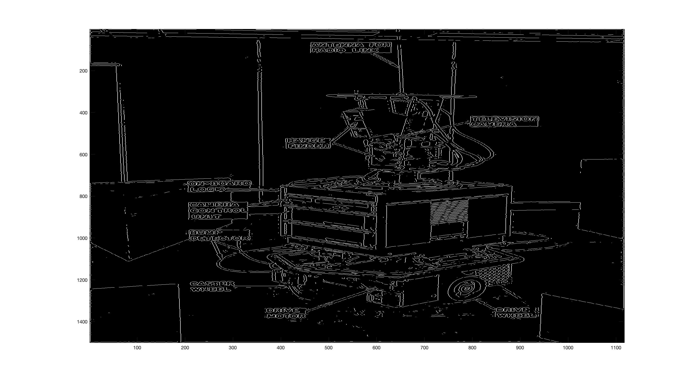

# Edge Detection

## Laplacian of Gaussian

Laplacian of Gaussian refers to convolution of a Gaussian smoothing mask with a Laplacian filter.
The Laplacian is a 2-D isotropic measure of the 2nd spatial derivative of an image. Hence it can be used for effective edge detection.

## Cell Detection

Anaysis of multiple technices applied with varying size and levels of smoothing. to produce effective edge detection on an image of cells.
Report/Resources/images/best.eps

|             | Sobel  | Roberts | Gaussian | LoG    | Laplacian |
|-------------|--------|---------|----------|--------|-----------|
| Specificity | 0.8514 | 0.8569  | 0.8363   | 0.8005 | 0.7204    |
| Sensitivity | 0.8698 | 0.8525  | 0.8773   | 0.9353 | 0.5534    |